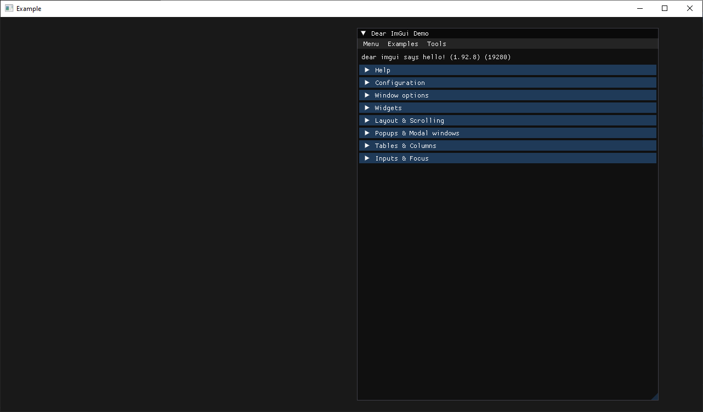

# imgui-go

A binding library of imgui for Go.

## Example

Try the example with `go run github.com/nitrix/imgui-go/example@latest`.

The sources for it are located here [example/example.go](example/example.go).

## Compatibility

You're currently limited to using the OpenGL and GLFW backends. The GLFW window must be created by [this other library](https://github.com/nitrix/glfw-go)
because the backends rely on recently added enums that not all the other popular bindings support.

This package requires CGO and a C++17-capable toolchain.

Native dependencies:

- Windows: a working Go CGO toolchain and OpenGL-capable graphics drivers.
- Linux: X11, OpenGL, and audio development headers. On Debian/Ubuntu, install `libx11-dev libxrandr-dev libxinerama-dev libxcursor-dev libxi-dev libgl-dev libasound2-dev libxxf86vm-dev`.
- macOS: Xcode command line tools. The package links CoreFoundation, OpenGL, Cocoa, IOKit, and QuartzCore frameworks.

## API Notes

The generated API intentionally stays close to cimgui. Default arguments from C++ are explicit in Go, and overload suffixes are preserved where cimgui exposes them.

Variadic C functions keep their formatting-style API in Go, for example `Text("count: %d", n)`. Escape literal percent signs as `%%`, just like imgui/cimgui.

## Credits

See [this repo](https://github.com/cimgui/cimgui) for the bindings C library and [this repo](https://github.com/ocornut/imgui) for the original C++ library.

## License

This is free and unencumbered software released into the public domain. See the [UNLICENSE](UNLICENSE) file for more details.
